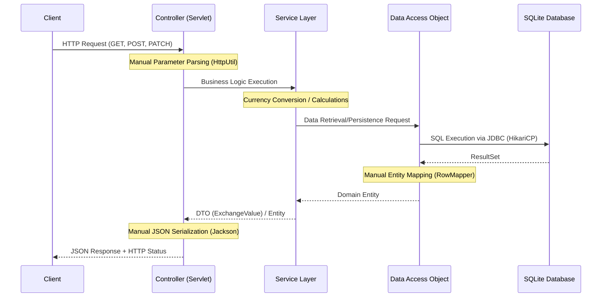

# Currency Exchange API

A low-level, high-control RESTful API built with Java 25 for managing currency exchange rates and performing financial conversions. This project demonstrates manual infrastructure management, from database connection pooling and migrations to custom request body parsing and dependency injection.

## Architecture & Data Flow

The application follows a tiered architecture to ensure a clear separation of concerns. Below is the end-to-end data flow from the client to the database.

### Data Flow Diagram



## Key Technical Approaches & Challenges

### Low-Level Database & Request Management

Unlike high-level frameworks, this project manages the entire lifecycle of a request manually. This includes:

* **Manual Request Parsing**: Handling complex scenarios like the `PATCH` method, where servlet containers do not automatically parse `x-www-form-urlencoded` bodies.
* **Explicit Mapping**: Manually mapping database `ResultSet` rows to Java Entities and then to DTOs for JSON output.

### Manual Dependency Injection (DI)

To avoid the "Singleton anti-pattern" and improve testability, the project implements a manual DI container via `AppContext`.

* **Decoupling**: Services receive their DAOs through constructors rather than static `getInstance()` calls.
* **Centralized Wiring**: All components are instantiated and wired in a single location.

### Application Lifecycle & Configuration

An `AppContextListener` serves as the application's entry point, managing the global configuration.

* **Automated Migrations**: Upon initialization, the listener triggers `DatabaseManager` to run Flyway migrations, ensuring the SQLite schema is always up-to-date.
* **Resource Cleanup**: It ensures the HikariCP connection pool is gracefully closed during application shutdown.

### Global Exception Handling & Status Codes

A centralized `ExceptionFilter` manages application-wide errors, ensuring consistent API responses.

* **Exception Mapping**: Custom business exceptions (e.g., `EntityNotFoundException`, `DataIntegrityViolationException`) are mapped to precise HTTP status codes like `404 Not Found`, `409 Conflict`, or `400 Bad Request`.

### Persistence Layer & HikariCP

The project utilizes **HikariCP** for high-performance connection pooling with SQLite.

* **SQLite Constraints**: Mandatory configuration of `PRAGMA foreign_keys = ON;` is enforced at the connection level to maintain relational integrity.


## Setup & Deployment

### Prerequisites

* Java 25 JDK
* Maven 3.9+
* Servlet Container (e.g., Apache Tomcat 10+)

### Environment Configuration

The application requires an environment variable to locate the database file:

* **DB_DIR**: Set this to the directory where the SQLite database file should be stored (e.g., `/var/lib/app/data`).

### Building the Project

1. Clone the repository.
2. Navigate to the project root and run:
```bash
mvn clean package

```
This will generate a `currency-exchange-web.war` file in the `currency-exchange-web/target/` directory.

### Deployment

1. Copy the generated `.war` file to your servlet container's deployment directory (e.g., `webapps/` for Tomcat).
2. Start the container.
3. The application will automatically perform database migrations and seed initial data upon startup.


## Technologies Used

* **Java 25** (Core language)
* **Persistence**: SQLite, JDBC, HikariCP, Flyway
* **Web**: Jakarta Servlet API, Jackson Databind
* **Utilities**: Lombok
